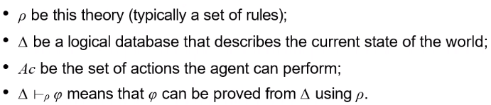
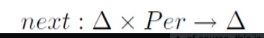
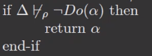

> Tác tử có khả năng suy luận

# Agent architecture
- Architecture
    - A set of software/hardware/modules
    - Data & control flow (interactions) between modules

- Classes
    - Symbolic Reasoning Agents
        - Make decisions via **symbol manipulation**
        - Agents use explicit logical reasoning
    - Reactive Agents
        - Learning
        - Based on the environment
    - Hybrid agent

## Symbolic Reasoning Agents
- A particular type of **knowledge-based system**
- Deliberative (Có chủ đích) agent
    - A symbolic model of the world
    - Makes decisions
    - Issues
        - The transduction problem: identifying objects (limited)
        - The representation problem: represent objects (large amount of information)
        - Symbol manipulation

## Deductive Reasoning Agents
- Making decisions based on theorem proving
- Notations
    - 
    - Database: internal states
    - Theory is used to prove
- [[Agents with States|C2-IntelligentAgents#agents-with-states]]
    - Next function:
        - 
    - Action function:
        - Find an action explicitly **prescribed**
            - Returns the action if it is proved
        - Find an action not excluded
            - 
            - Returns the action if NotDo(action) can not be proved
- Problems & Solutions
    - Convert inputs to perceptions (weaken the logic; use symbolic, non-logical representations)
    - Shift the emphasis of reasoning from run time to **design time**

# Agent oriented programming
- Keys:
    - Programming in terms of intentional (chủ đích) notions

## Agent0
- Agent:
    - a set of capabilities
    - a set of initial beliefs
    - a set of initial commitments
    - a set of **commitment rules**

- Commitment rule
    - components
        - a message condition
        - a mental condition
        - an action
    - paraphrase
        - if i receive a message from **agent** 
            - Which requests me to do **action** at **time**
        - I believe that
            - **agent** is a friend
            - I **can** do the action
            - at **time**, I am **not commited** to doing any other action
        - Then I commit to doing **action** at **time**
        

- Decision cycle
    - the message condition => The messages the agent has received
    - the mental condition => The beliefs of the agent
    - if the **rule fires**, the agent becomes commited to the action

- Action types
    - Private
    - Communicative

- Message types
    - Requests (commit)
    - Unrequests (refrain)
    - Inform (pass the information)

## PLACA
- Plan and communicate requests for action via **high-level goals**
- In terms of **mental change rules**

## MetateM
- Each agent is given a **temporal logic specification** of the behaviour it should exhibit
- Modal operators: How the truth of propositions changes over time
    - World = discrete states
    - 1 single history, a number of possible futures