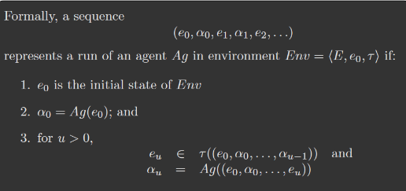

# Công nghệ tác tử

## Chapter 1 key notes
- Multi-agent system ![[C1-Introduction#multi-agent-system,1:#*]]

## Chapter 2 key notes
- Agent ~ Autonomous ~ Making decisions
  - What to perform?
  - When to perform?

- Agents
  - Have attitude
    - Autonomous
    - Smart - flexible behaviours
    - Active
  - Environment awareness
  - Operate in a limited domain

- ![[C2-IntelligentAgents#environment-properties,1:#*]]

- Intelligent agents
  - Reactive
    - Environment aware
    - Responds to changes
  - Pro-active (achieving goals)
  - Social ability (working with others)

- The behaviour of an agent can be predicted using its intention

- Abstract architecture
  - World has a finite set of states
  - Agents have a set of possible actions
  - A run: a sequence of actions and states

- Notion
  - Environment: states, initial states, transformer function
  - Agent: runs -> action
  - A system: 
    - a pair of an agent & an environment
    - has a set of possible runs
    -  

- Deliberative vs Purely reactive
  - Deliberative: Making decisions Reactive agent
    - Always do the **same thing** in the **same state**

- ![[C2-IntelligentAgents#agents-with-states,1:#*]]

- Utility function:
  - Rewarding agents
  - Locality: utility for each state, no long term view
  - Reinforcement: a discount for states later on
  - Sequential decision making: Utilities depend on the route
  - Assign utilities for runs: long term view
  - Expected utility: run utility * run possibility

- Optimal agents
  - Maximizes the expected utility (on average)
  - **Bounded**: only those agents that **can be implemented on machine m**

- Task environment
  - Predicate task specification: succeeds/fails
  - A pair: environment, task specification
    - the system's properties
    - judging criterias
  - Judging
    - Pessimistic: all run must be succeeded
    - Optimistic: a run is succeeded
  - The probability of success
    - Sum of all success runs
  - Types
    - Achivement: to the goal
    - Maintenance: not to fail

## Chapter 3 key notes

- Architecture: modules & interaction between them

- Symbolic Reasoning Agents: Modeling the world using symbols

- Deductive Reasoning Agents:
  - Theorem proving
  - Find a possible action by
    - Prove it works
    - Prove NotDo(action) can not be proved

- Agent oriented programming: using the intentional notions